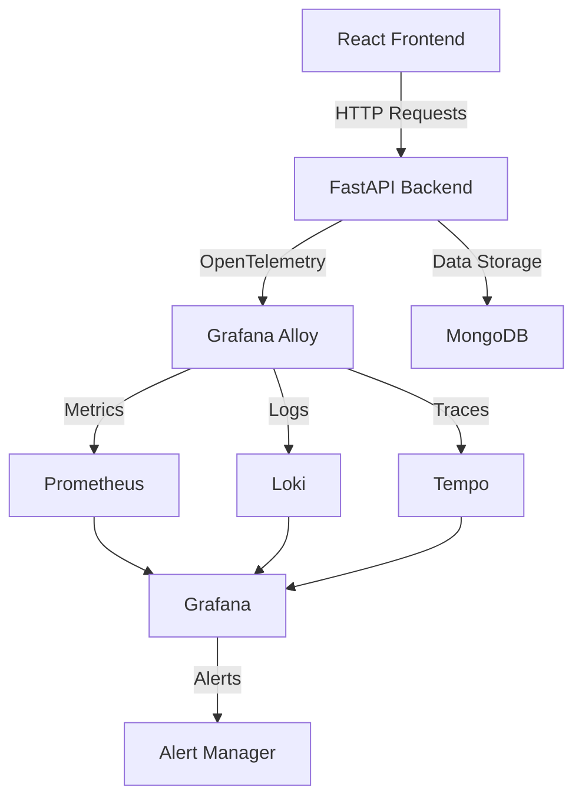

# 💳 Payment Gateway - Observability Enabled

<div align="center">


*A full-stack payment gateway system with comprehensive observability using OpenTelemetry*

</div>

---

## 📋 Table of Contents

- [🎯 Purpose](#-purpose)
- [🌟 Impact](#-impact)
- [📖 What is Observability?](#-what-is-observability)
- [🏗️ Architecture](#️-architecture)
- [🗂️ Project Structure](#️-project-structure)
- [🚀 Getting Started](#-getting-started)
- [⚙️ Features](#️-features)
- [📊 Grafana Dashboards](#-grafana-dashboards)
- [🔔 Alerts Configuration](#-alerts-configuration)
- [🛠️ Tech Stack](#️-tech-stack)
- [📜 License](#-license)

---

## 🎯 Purpose

This project demonstrates a **production-ready payment gateway** system with comprehensive observability instrumentation. Built with **FastAPI** (backend) and **React.js** (frontend), it showcases:

- **End-to-end observability** using open-source tools
- **OpenTelemetry** integration for metrics, logs, and traces
- **Real-time monitoring** with Grafana, Prometheus, Loki, and Tempo
- **Industry-standard practices** for distributed system monitoring

---

## 🌟 Impact

| Feature | Benefit |
|---------|---------|
| 🔍 **Performance Monitoring** | Identify bottlenecks and optimize system performance |
| 🚨 **Error Detection** | Trace errors with high granularity across services |
| 📊 **Real-time Insights** | Monitor system health with live dashboards |
| 📈 **Scalability Planning** | Data-driven capacity planning and resource allocation |
| 🔧 **DevOps Excellence** | Industry-grade observability practices |

---

## 📖 What is Observability?

Observability is the ability to **measure the internal state** of a system by examining its outputs. It enables developers and operators to understand system behavior and troubleshoot issues effectively.

### 🔍 The Three Pillars of Observability

| 📊 **Metrics** | 📝 **Logs** | 🔗 **Traces** |
|----------------|-------------|---------------|
| *Quantitative measurements* | *Textual event records* | *Request journey tracking* |
| • Request count | • Application events | • Distributed tracing |
| • Response times | • Error messages | • Service interactions |
| • CPU/Memory usage | • Debug information | • Latency breakdown |
| • Error rates | • Audit trails | • Performance insights |

- For More knowledge feel free to see this docs https://observability-using-grafana-alloy.hashnode.space/default-guide/obervability-using-grafana-alloy?t=1751020251823

---

## 🏗️ Architecture



---

## 🗂️ Project Structure

```
Payment-Gateway-Obs/
│
├── 🐳 docker-compose.yaml          # Multi-service orchestration
├── ⚙️ config.alloy                # Grafana Alloy configuration
├── 📊 prometheus.yml              # Prometheus configuration
├── 🔍 tempo.yaml                  # Tempo configuration
│
├── 🖥️ server/                      # FastAPI Backend
│   ├── 🐳 Dockerfile
│   ├── 🚀 main.py                 # Application entry point
│   ├── 💾 databases.py            # Database configuration
│   ├── 📋 schemas.py              # Pydantic models
│   ├── 📦 requirements.txt        # Python dependencies
│   └── 🔗 routers/
│       ├── 💳 payment.py          # Payment processing
│       ├── 📊 transactions.py     # Transaction management
│       ├── 👥 admin.py            # Admin operations
│       └── 🔍 checkMongo.py       # Database health checks
│
└── 🎨 client/                      # React Frontend
    ├── 📁 src/
    ├── 📦 package.json
    └── ⚙️ vite.config.js
```

---

## 🚀 Getting Started

### Prerequisites

- 🐳 **Docker** and **Docker Compose**
- 💻 **Git**
- 🌐 **Web Browser**

### Installation Steps

1. **Clone the Repository**
   ```bash
   git clone https://github.com/your-username/Payment-Gateway-Obs.git
   cd Payment-Gateway-Obs
   ```

2. **Open client**
   ```bash
   cd client
   ```

3. **Install node modules**
   ```bash
   npm i
   ```

4. ***Launch the client***
   ```bash
   npm run dev
   ```

   Open New Terminal
   
6. **Open server**
    ```bash
       cd server
    ```

7. **Create a Virtual Environment & Activate the venv**
   ```bash
   python -m venv venv
   ```
   For windows
   ```bash
   venv/Scripts/activate 
   ```
   For linux/macOS    
   ```bash
   source venv/bin/activate
   ```

9. **Run the requirements.txt**
   ```bash
   pip install -r requirements.txt
   ```

10. **Launch the Server**
    ```bash
    uvicorn main:app --reload
    ```

   If you're using Windows machine, Install Docker and Docker Desktop. Verify the docker documentation for the installation of docker and docker desktop.
   If you're using Linux machine, then it defaultly has Docker Engine. (So there is no requirement of docker desktop)

   Open a New Terminal
   Once all installed

11. **Launch the Docker Compose**
    ```bash
    docker-compose up --build
    ```

    This will the docker container and in the docker desktop all ports will be visible u can access from there.
    For Linux users who are not using docker desktop, u can use the ports mentioned here below (#Service URLs)

12. **Closing the docker**
    ```bash
    cltr + c
    ```
    
13. **Removing the files from Docker**
    ```bash
    docker-compose down -v
    ```
   
   Wait for all services to start, then access:

### 🌐 Service URLs

| Service | URL | Purpose |
|---------|-----|---------|
| 🎨 **Frontend** | [http://localhost:5173](http://localhost:5173) | React UI |
| 🔧 **Backend API** | [http://localhost:8000](http://localhost:8000) | FastAPI endpoints |
| 📊 **Grafana** | [http://localhost:3000](http://localhost:3000) | Dashboards & visualization |
| 📈 **Prometheus** | [http://localhost:9091](http://localhost:9091) | Metrics collection |
| 🔍 **Tempo** | [http://localhost:3200](http://localhost:3200) | Distributed tracing |
| 📜 **Loki** | [http://localhost:3100](http://localhost:3100) | Log aggregation |

> **Default Grafana Credentials:** `admin` / `admin`

---

## ⚙️ Features

### 🔗 API Endpoints

| Method | Endpoint | Description | Observability Features |
|--------|----------|-------------|----------------------|
| `POST` | `/payment` | Process payment transactions | ✅ Metrics, Logs, Traces |
| `GET` | `/transactions` | Retrieve transaction history | ✅ Performance monitoring |
| `POST` | `/admin` | Simulate error scenarios | ✅ Error tracking |
| `GET` | `/admin/health` | System health check | ✅ Availability metrics |

### 📊 Observability Features

#### 📈 **Metrics Collection**
- Request count and rates
- Response time percentiles
- Error rates by endpoint
- System resource usage
- Custom business metrics

#### 📝 **Structured Logging**
- Request/response logging
- Error context capture
- Performance markers
- Business event tracking
- Correlation IDs

#### 🔗 **Distributed Tracing**
- End-to-end request tracking
- Service dependency mapping
- Latency breakdown analysis
- Error propagation tracing
- Performance bottleneck identification

---

## 📊 Grafana Dashboards

### Available Dashboards

1. **🎯 Application Performance Monitoring (APM)**
   - Request throughput and latency
   - Error rates and success metrics
   - Service health indicators

2. **🔍 Distributed Tracing**
   - Request flow visualization
   - Service dependency graphs
   - Latency heatmaps

3. **📊 Infrastructure Monitoring**
   - System resource utilization
   - Database performance
   - Container metrics

4. **🚨 Error Analysis**
   - Error rate trends
   - Exception tracking
   - Failure pattern analysis

---

## 🔔 Alerts Configuration

### Predefined Alert Rules

| Alert | Condition | Severity |
|-------|-----------|----------|
| 🚨 **High Error Rate** | Error rate > 5% for 5 minutes | Critical |
| 🐌 **Slow Response** | P95 latency > 1000ms for 2 minutes | Warning |
| 📉 **Low Transaction Volume** | Transaction rate < 10/hour | Warning |
| 💾 **Database Connection** | MongoDB connection failures | Critical |
| 🔧 **Service Unavailable** | Health check failures | Critical |

### Alert Channels
- 📧 Email notifications
  we can customize the summary and subject of the mail. For eg, Below the email sent by grafana for the admin error
  
  
---

## 🛠️ Tech Stack

### Backend
- **🚀 FastAPI** - High-performance Python web framework
- **🔍 OpenTelemetry** - Observability instrumentation
- **💾 MongoDB** - Document database
- **📊 Pydantic** - Data validation and serialization

### Frontend
- **⚛️ React.js** - UI framework
- **⚡ Vite** - Build tool and dev server
- **🎨 Modern CSS** - Responsive design

### Observability Stack
- **📊 Grafana** - Visualization and dashboards
- **📈 Prometheus** - Metrics collection and alerting
- **📜 Loki** - Log aggregation
- **🔍 Tempo** - Distributed tracing
- **🔄 Grafana Alloy** - Telemetry collection agent

### Infrastructure
- **🐳 Docker** - Containerization
- **🔧 Docker Compose** - Multi-service orchestration

---

## 📜 License

This project is licensed under the **MIT License** - see the [LICENSE](LICENSE) file for details.

---

<div align="center">

**⭐ Star this repository if you find it helpful!**

Made by [Sushindh A](https://github.com/Sushindh)

</div>
